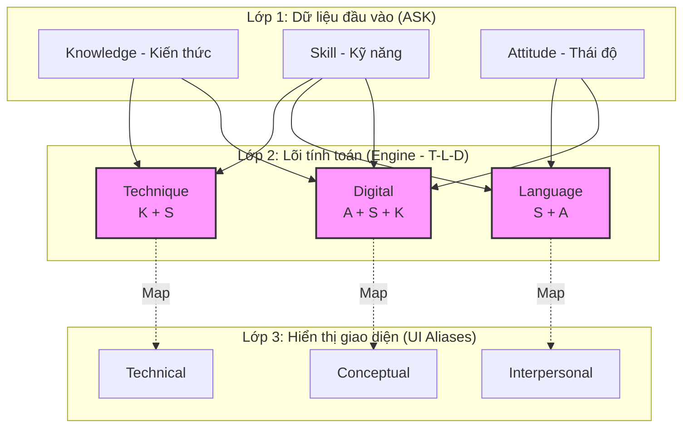

# Phân tích Kiến trúc Hệ thống FNX Talent Factory

Tài liệu này giải đáp các thắc mắc về kỹ thuật và đề xuất các hướng đi kiến trúc cho dự án.

## 1. Kiến trúc hiện tại (Monolithic Agentic - JS)

Hiện tại, tôi đang xây dựng theo mô hình **Modular Monolithic** bằng JavaScript (Node.js).

- **Tại sao lại dùng JS thay vì Python (.py)?**
    - **Tốc độ tích hợp:** Vì bạn muốn xây dựng web app (Next.js/Vite), việc dùng chung ngôn ngữ JS cho cả Frontend và Backend giúp việc truyền dữ liệu giữa AI và giao diện diễn ra cực nhanh, không cần thông qua API phức tạp.
    - **Real-time:** JS xử lý các tác vụ bất đồng bộ (Async/Await) rất tốt cho việc streaming kết quả từ Agent lên màn hình.
    - **Phù hợp MVP:** Giúp bạn có sản phẩm chạy được (Demo) nhanh nhất.

- **Workflow & Skills nằm ở đâu?**
    - **Workflow (Quy trình):** Nằm chính tại [FactoryCoordinator.js](file:///Users/quynhdinh/.gemini/antigravity/scratch/fnx-talent-factory/src/lib/agents/FactoryCoordinator.js). Đây là nơi định nghĩa "Dây chuyền" (Pipeline) - bước nào chạy trước, bước nào chạy sau.
    - **Skills (Kỹ năng):** Nằm bên trong các phương thức (methods) của từng Agent. Ví dụ: Skill `decodeJD` nằm trong [JDDecoderAgent.js](file:///Users/quynhdinh/.gemini/antigravity/scratch/fnx-talent-factory/src/lib/agents/JDDecoderAgent.js).

---

## 2. Đề xuất 2 kiến trúc thay thế (Options)

Nếu bạn muốn mở rộng quy mô thành một "Nhà máy" thực thụ, hãy cân nhắc 2 phương án sau:

### Option A: Hybrid Architecture (Python backend + JS frontend)
Đây là kiến trúc phổ biến nhất trong các dự án AI chuyên sâu.
- **Cấu trúc:** 
    - **Backend (Python/FastAPI):** Chứa các Agent (.py) sử dụng các thư viện AI mạnh nhất như LangGraph, CrewAI hoặc AutoGen. Rất mạnh trong việc xử lý dữ liệu Hóa chất và MCP.
    - **Frontend (Next.js):** Chỉ lo việc hiển thị dashboard.
- **Ưu điểm:** Tận dụng được tối đa hệ sinh thái AI của Python.
- **Nhược điểm:** Phải quản lý 2 mã nguồn riêng biệt, cần thiết lập API (REST/gRPC) để chúng nói chuyện với nhau.

### Option B: Event-Driven Micro-services (Kiến trúc hướng sự kiện)
Dành cho quy mô xử lý hàng chục ngàn hồ sơ đồng thời.
- **Cấu trúc:** Mỗi Agent là một dịch vụ độc lập (Microservice). Chúng "nói chuyện" với nhau qua một hàng đợi thông báo (Message Queue như RabbitMQ hoặc Redis).
- **Quy trình:** Khi có 1 JD mới -> Đẩy vào Queue -> JDDecoderAgent "nhặt" về xử lý -> Xong thì đẩy kết quả vào Queue cho Agent tiếp theo.
- **Ưu điểm:** Khả năng mở rộng (Scalability) tuyệt vời. Một Agent bị treo không làm sập cả nhà máy.
- **Nhược điểm:** Rất phức tạp để triển khai và bảo trì ở giai đoạn đầu.

---

## 4. Kiến trúc Tri thức 3 Lớp (3-Layer Knowledge Architecture)

Để giải quyết việc nâng cấp lõi tính toán mà không làm xáo trộn giao diện người dùng, hệ thống FNX sử dụng mô hình **Mapping Bridge (Cầu nối Ánh xạ)**.

### 4.1 Sơ đồ Ánh xạ (The Mapping Bridge)

### 4.2 Chi tiết ánh xạ logic (Shadow Mapping)

| Lớp Hiển thị (UI - Katz) | Lớp Tính toán (Engine - T-L-D) | Công thức (ASK Mapping) | Giải thích |
| :--- | :--- | :--- | :--- |
| **Technical** | **Technique** | $K + S$ | Tập trung vào tri thức thực chứng và khả năng thao tác kỹ thuật. |
| **Interpersonal** | **Language** | $S + A$ | Tập trung vào khả năng giao tiếp, ngoại ngữ và sự hợp tác. |
| **Conceptual** | **Digital** | $A + S + K$ | Tập trung vào thái độ linh hoạt, kỹ năng số và tư duy thích nghi. |

> [!NOTE]
> Chiến lược này giúp chúng ta nâng cấp độ chính xác của AI và các bộ máy tính điểm mà không cần phải đào tạo lại người dùng về các thuật ngữ mới ngay lập tức.

---

## 5. Lời khuyên của Antigravity
...
